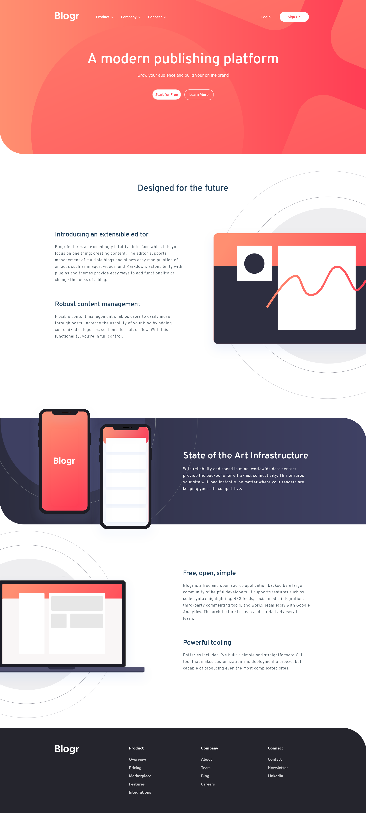

# Frontend Mentor - Blogr landing page solution

This is a solution to the [Blogr landing page challenge on Frontend Mentor](https://www.frontendmentor.io/challenges/blogr-landing-page-EX2RLAApP).

## Table of contents

- [Overview](#overview)
  - [The challenge](#the-challenge)
  - [Screenshot](#screenshot)
  - [Links](#links)
- [My process](#my-process)
  - [Built with](#built-with)
  - [Continued development](#continued-development)
- [Author](#author)

## Overview

### The challenge

Users should be able to:

- View the optimal layout for the site depending on their device's screen size
- See hover states for all interactive elements on the page

### Screenshot

### Links

- Solution URL: [https://github.com/by-yee/fem-blogr-landing-page](https://github.com/by-yee/fem-blogr-landing-page)
- Live Site URL: [https://by-yee.github.io/fem-blogr-landing-page/](https://by-yee.github.io/fem-blogr-landing-page/)

## My process

### Built with

- Semantic HTML5 markup
- CSS custom properties
- Flexbox
- CSS Grid
- Mobile-first workflow
- Javascript

### Continued development

In this project, the header navigation menu (both desktop and mobile) and section 2 illustration image are the parts that I spend most of my time to build.

In the future project, I would like to add some transition on the accordion dropdown menu and also try other implementation method for the navigation menu.

## Author

- Frontend Mentor - [@by-yee](https://www.frontendmentor.io/profile/by-yee)